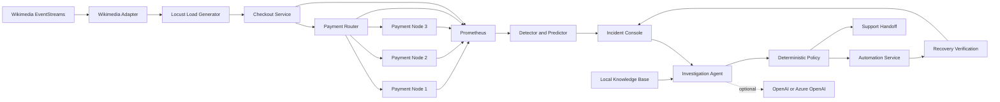

# PulseGuard
[](https://github.com/RakeshSw/PulseGuard/actions/workflows/docker-e2e.yml)
**Predict failures. Protect reliability.**

PulseGuard is an agentic reliability engineering proof of concept that turns live operational signals into a governed incident-response workflow. It generates realistic local checkout traffic, observes service telemetry, detects operational risk, investigates incidents with bounded evidence, recommends a response, applies deterministic policy, executes only allowlisted actions, verifies recovery, and prepares support handoffs when human intervention is required.

> PulseGuard is a portfolio and learning project. It is not a production incident-management or autonomous-remediation product.

## What the project demonstrates

- Wikimedia EventStreams controls the intensity of **local synthetic** checkout traffic.
- A checkout path routes requests across three payment nodes.
- Toxiproxy and controlled adapters inject latency, timeout, corruption, dependency, capacity, authentication, certificate, and disk-pressure scenarios.
- Prometheus and Grafana expose metrics and operational state.
- Deterministic detection opens incidents from observed service behavior.
- The investigation agent receives telemetry, topology, incident facts, bounded automation context, and a transparent local knowledge base.
- An optional OpenAI or Azure OpenAI provider explains the evidence and recommends an allowlisted action.
- Deterministic governance decides whether an action is automatic, approval-required, human-only, or denied.
- PulseGuard verifies recovery from telemetry before resolving an incident.

Raw Wikimedia event content is not sent to the checkout application or the model. Only aggregate traffic indicators may be included in an investigation.

## Agentic operations loop

```text
observe -> detect -> investigate -> decide -> govern -> act -> verify -> resolve or hand off
```

## Architecture



The public product name is **PulseGuard**. Internal identifiers beginning with `opsai-` or `OPSAI_` are retained for compatibility across Docker service names, images, metrics, APIs, persisted volumes, and tests.

## Browser demo with GitHub Codespaces

PulseGuard can run entirely in a browser-hosted GitHub Codespace, including all 18 Docker Compose services. The Codespaces configuration installs Docker-in-Docker, forwards the demo ports privately, and supports both deterministic mock and optional real-AI investigation modes.

See [CODESPACES.md](CODESPACES.md) for creation, startup, secret configuration, port access, shutdown, and cleanup instructions.
## Prerequisites

- Windows 10/11 or another Docker-capable operating system
- Docker Desktop with Docker Compose v2
- PowerShell 5.1 or later for the supplied scripts
- Sufficient CPU and memory for 18 Compose services; allocating approximately 8 GB to Docker is a practical starting point
- Optional OpenAI or Azure OpenAI access for the real-AI investigation path

## Windows quick start

Extract the ZIP, open PowerShell in the extracted `PulseGuard-1.0.1-poc` directory, then run:

```powershell
Set-ExecutionPolicy -Scope Process -ExecutionPolicy Bypass -Force
.\scripts\start.ps1
```

On first start, the script:

1. Creates `.env` from `.env.example`.
2. Generates local random values for the database password, Grafana password, automation token, and partner token.
3. Builds and starts the complete environment.
4. Waits for the primary endpoints to become ready.

The generated `.env` is local-only and excluded by `.gitignore`.

Detailed clean-room instructions are in [SETUP_WINDOWS.md](SETUP_WINDOWS.md).

## Main URLs

| Surface | URL |
|---|---|
| Checkout API | http://localhost:8080/ |
| Payment router | http://localhost:8081/nodes |
| Locust | http://localhost:8089/ |
| Scenario Controller | http://localhost:8090/ |
| Wikimedia traffic profile | http://localhost:8093/profile |
| Corruption adapter | http://localhost:8094/profile |
| PulseGuard Incident Console | http://localhost:8095/ |
| PulseGuard Investigation | http://localhost:8096/ |
| Automation and support | http://localhost:8097/ |
| Predictive analysis | http://localhost:8098/ |
| External authentication demo | http://localhost:8099/ |
| Prometheus | http://localhost:9090/ |
| Grafana | http://localhost:3000/ |

Grafana credentials are generated into the local `.env` during first start.

## AI modes

### Deterministic mock mode

The default is:

```env
LLM_PROVIDER=mock
```

This exercises the complete workflow and UI with deterministic fallback analysis. It must not be presented as a real-AI result.

### Azure OpenAI

Set these values in the local `.env`:

```env
LLM_PROVIDER=azure_openai
AZURE_OPENAI_ENDPOINT=https://YOUR-RESOURCE.openai.azure.com
AZURE_OPENAI_API_KEY=YOUR_KEY
AZURE_OPENAI_DEPLOYMENT=YOUR_DEPLOYMENT_NAME
```

Then recreate the investigation agent:

```powershell
docker compose up -d --build --force-recreate opsai-agent
Invoke-RestMethod http://localhost:8096/health | ConvertTo-Json -Depth 6
```

### OpenAI

```env
LLM_PROVIDER=openai
OPENAI_API_KEY=YOUR_KEY
OPENAI_MODEL=gpt-5-mini
```

Then recreate `opsai-agent` as shown above.

## Recommended demo

1. Start with a clean baseline and zero incidents.
2. Show the live Wikimedia-derived traffic profile and Locust target.
3. Inject a controlled payment-node latency or timeout scenario.
4. Wait for deterministic detection to confirm the symptom.
5. Open the incident and review evidence, topology, investigation route, provider response, recommendation, and confidence.
6. Review the governance decision.
7. Approve the action only when policy requires operator authorization.
8. Show the action result and telemetry-based recovery verification.
9. Review the final resolution or support handoff.

See [docs/demo.html](docs/demo.html) for the publication-ready walkthrough.

## Useful commands

```powershell
# Start or rebuild
.\scripts\start.ps1

# Status and health summary
.\scripts\status.ps1

# Platform validation
.\scripts\test-opsai-v06.ps1

# Stop while preserving volumes
.\scripts\stop.ps1

# Reset runtime data and start again
.\scripts\reset.ps1
```

## Complete destructive cleanup

The project-scoped cleanup script removes PulseGuard containers, volumes, PostgreSQL data, Prometheus history, Grafana runtime data, locally built PulseGuard images, logs, and caches. It does not run a global Docker prune.

```powershell
.\scripts\clean-pulseguard-completely-for-transfer-v1.ps1 `
  -ProjectRoot $PWD `
  -ConfirmDataLoss
```

Add `-RemoveLocalSecrets -RemovePatchBackups` only when preparing a clean transfer or public repository copy.

## Safety boundaries

- The investigation agent has no scenario-controller ground-truth access.
- Model context is bounded to incident-relevant evidence.
- Raw Wikimedia payloads and secrets are excluded from AI context.
- Only allowlisted actions can be executed.
- Policy separates automatic, approval-required, human-only, and denied outcomes.
- Command completion is not treated as recovery; telemetry must verify it.
- No Docker socket or unrestricted shell access is exposed to the agent.
- Fault injection and load generation must remain inside systems you own or are authorized to test.

Read [SECURITY.md](SECURITY.md) before running or publishing the project.

## Repository layout

```text
.
|-- compose.yaml
|-- load-generator/
|-- observability/
|-- services/
|-- scripts/
|-- docs/
|-- .env.example
|-- README.md
|-- SETUP_WINDOWS.md
|-- SECURITY.md
`-- LICENSE
```

## Publication

Before staging the repository, delete the local runtime and secrets and run the release verifier:

```powershell
.\scripts\clean-pulseguard-completely-for-transfer-v1.ps1 `
  -ProjectRoot $PWD `
  -ConfirmDataLoss `
  -RemoveLocalSecrets `
  -RemovePatchBackups

.\scripts\verify-public-release.ps1 -ProjectRoot $PWD
```

See [GIT_PUBLISH_CHECKLIST.md](GIT_PUBLISH_CHECKLIST.md) for the final Git and GitHub Pages steps.

## Final Docker release validation

Before creating a public release, run the destructive clean-room validator on a Docker-enabled Windows machine:

```powershell
.\scripts\test-pulseguard-public-release-e2e.ps1 `
  -ProjectRoot $PWD `
  -ConfirmDataLoss
```

The validator creates fresh local secrets, removes previous PulseGuard containers and volumes, performs a no-cache build, starts every service, checks all health endpoints, validates public branding and secret-safe responses, and executes the focused incident lifecycle tests for detection, investigation, governance, approval, automatic repair, and recovery verification.

Use `-ReplaceExistingEnv` only when it is safe to replace an existing local `.env`. Add `-CleanAfterTest` to remove the generated `.env`, containers, volumes, and local images after the report is written. The result is written to `Downloads\PulseGuard-Docker-E2E-<timestamp>.txt`; failures produce a diagnostics ZIP.

## License

Released under the [MIT License](LICENSE).
