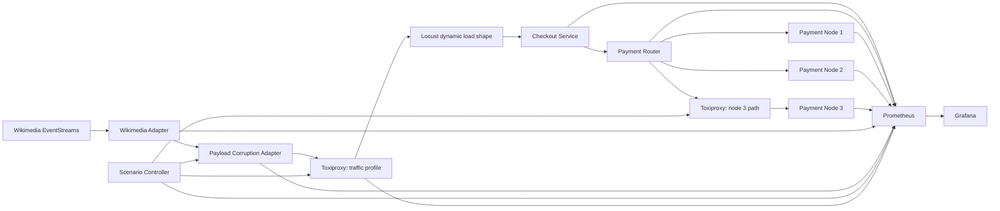

# Day 4 architecture

## Realism principles

- Only one process consumes the public Wikimedia stream.
- Public events are not sent directly to the retail application.
- The rolling activity rate controls the number of synthetic Locust users.
- Corruption is injected locally, so no public system is harmed.
- Toxiproxy changes real TCP behavior; metrics measure the actual consequences.
- Invalid, stale, or unavailable traffic profiles are rejected and Locust falls back safely.
- Payment node 3 sits behind a separate Toxiproxy path, allowing real latency, timeout, and connection-reset scenarios.
