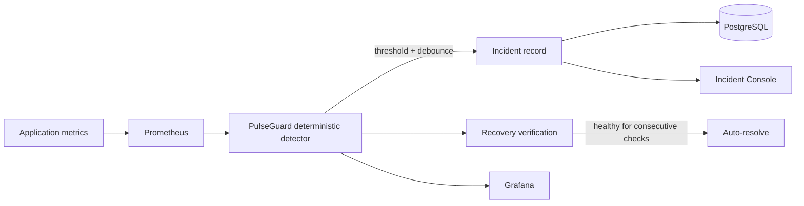

# Day 4 — deterministic detection and incident lifecycle

The detector intentionally does **not** read the Scenario Controller. It sees the same observable evidence an operations platform would see: latency histograms, retry rates and checkout failures.

## Rules

- Payment-node p95 latency above 0.8 seconds for three consecutive evaluations opens a high-severity latency incident.
- Router retry rate above 0.05 retries/second for two evaluations opens a critical timeout/failover incident.
- Checkout failures above 5% for two evaluations open a critical customer-impact incident.
- Recovery requires a lower threshold for four consecutive evaluations. This hysteresis prevents alert flapping.
- Timeout signals suppress a duplicate latency incident for the same node.

## Lifecycle

`OPEN → ACKNOWLEDGED → RESOLVED`

Resolution is automatic only after recovery is verified. Incidents and lifecycle events persist in PostgreSQL across container restarts.
