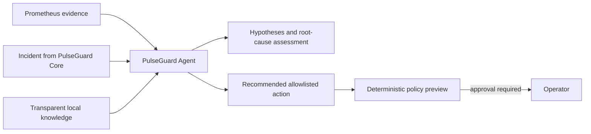

# Day 4 - Evidence-bounded investigation agent

The detector remains deterministic. The agent does not open or resolve incidents and cannot read Scenario Controller state. It collects telemetry, retrieves runbooks and historical cases, asks the configured LLM to produce a structured investigation, and passes the recommendation to deterministic policy validation. Day 4 does not execute remediation.

## Investigation audit trail

The shared PostgreSQL database stores a sanitized investigation audit record: provider and deployment, endpoint host, prompt preview, request context, parsed response, token usage when supplied by the provider, timing, retrieved knowledge, policy decision, and lifecycle events. API keys and authorization headers are never stored. The Incident Console reads this audit record directly from the shared database.
