# PulseGuard Scenario and Event Flows

PulseGuard demonstrates a governed agentic reliability workflow:

> **Telemetry detects the problem. AI investigates and recommends. Deterministic policy governs. Automation executes bounded actions. Telemetry verifies recovery.**

---

## Contents

1. [Master incident lifecycle](#1-master-incident-lifecycle)
2. [Complete platform block trace](#2-complete-platform-block-trace)
3. [End-to-end incident sequence](#3-end-to-end-incident-sequence)
4. [Payment-node latency](#4-payment-node-latency)
5. [Payment-node unavailability](#5-payment-node-unavailability)
6. [Shared dependency failure](#6-shared-dependency-failure)
7. [External authentication credential mismatch](#7-external-authentication-credential-mismatch)
8. [Disk capacity breach](#8-disk-capacity-breach)
9. [Certificate expiry](#9-certificate-expiry)
10. [Traffic-profile corruption](#10-traffic-profile-corruption)
11. [Application capacity degradation](#11-application-capacity-degradation)
12. [Predictive future breach](#12-predictive-future-breach)
13. [Governance decision flow](#13-governance-decision-flow)
14. [Recovery verification flow](#14-recovery-verification-flow)
15. [Component responsibilities](#15-component-responsibilities)

---

# 1. Master incident lifecycle

This diagram shows the common lifecycle followed by PulseGuard scenarios.

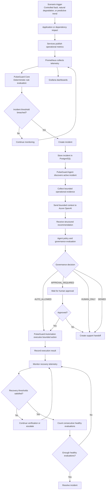

---

# 2. Complete platform block trace

This diagram shows how all major PulseGuard containers participate in the platform.

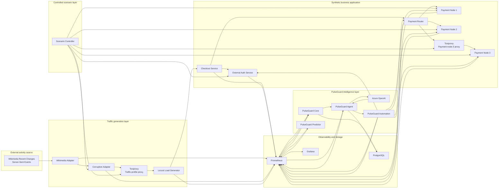

---

# 3. End-to-end incident sequence

This sequence diagram traces a complete incident from customer traffic to resolution.

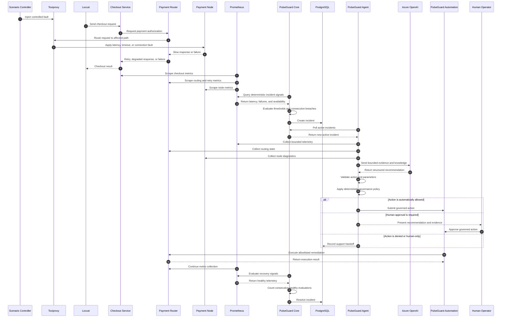

---

# 4. Payment-node latency

A controlled network delay affects one payment node.

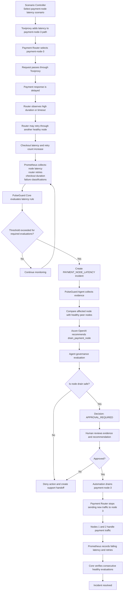

---

# 5. Payment-node unavailability

A payment node becomes unavailable or its network path is disabled.

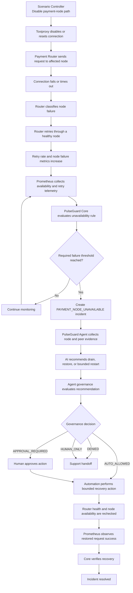

---

# 6. Shared dependency failure

A dependency used by multiple payment nodes fails, causing correlated failures.

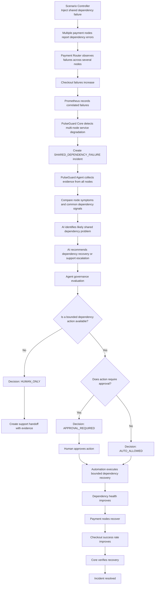

---

# 7. External authentication credential mismatch

The checkout credential no longer matches the external partner service.

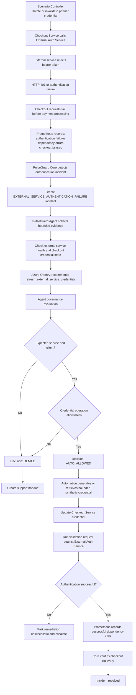

---

# 8. Disk capacity breach

A service reports high disk use, capacity pressure, or an approaching disk limit.

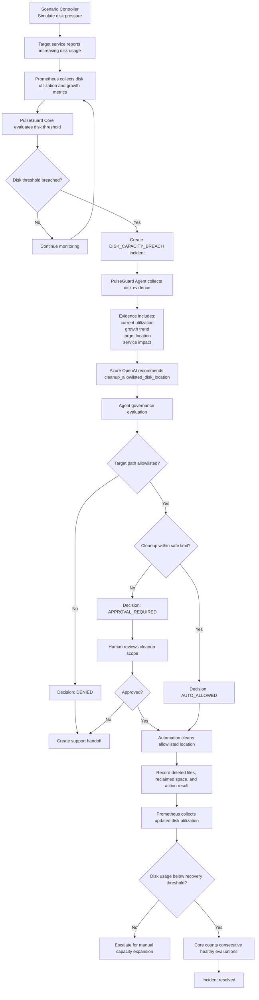

---

# 9. Certificate expiry

A bounded demo certificate is expired or approaching its expiry threshold.

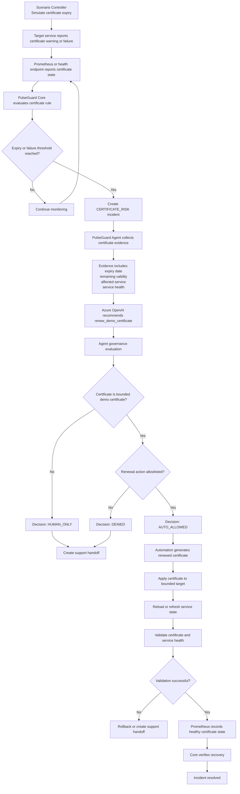

---

# 10. Traffic-profile corruption

The traffic profile is modified, amplified, malformed, or made unsafe.

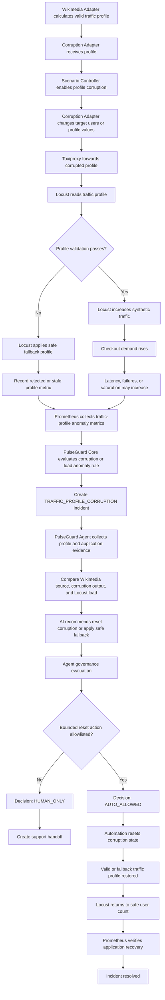

---

# 11. Application capacity degradation

Available payment-processing capacity falls below a safe level.

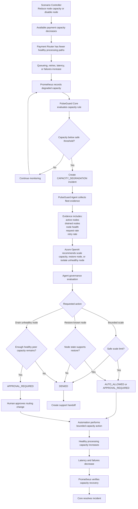

---

# 12. Predictive future breach

The predictor identifies a likely future threshold breach before a reactive incident is created.

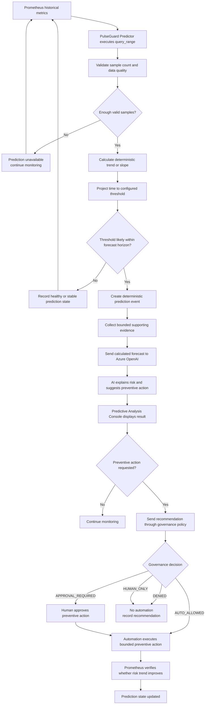

---

# 13. Governance decision flow

The LLM recommendation is treated as untrusted input. PulseGuard Agent applies deterministic policy before any action reaches Automation.

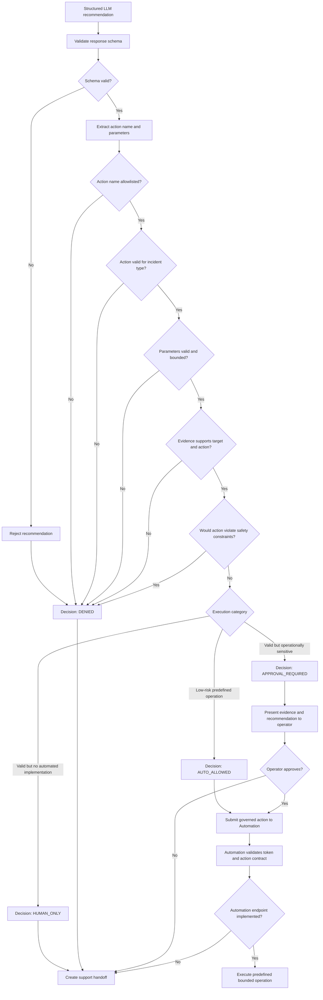

---

# 14. Recovery verification flow

PulseGuard does not resolve an incident only because an automation request returned successfully.

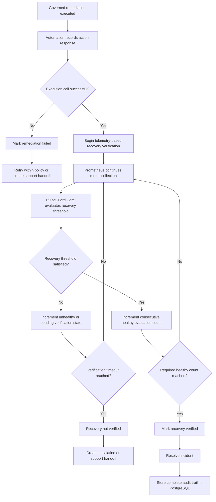

---

# 15. Component responsibilities

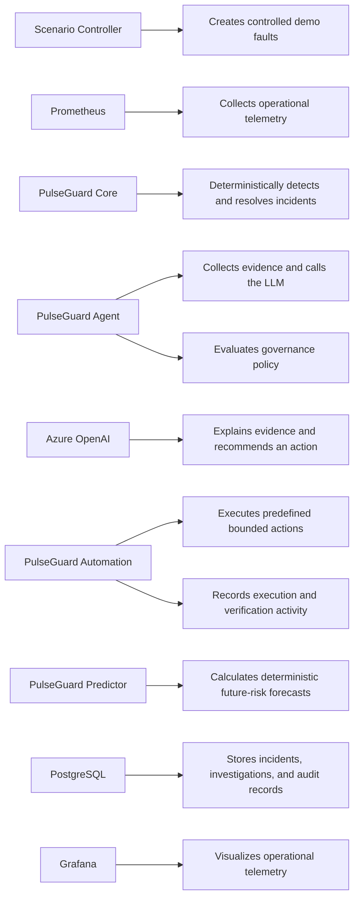

| Component | Primary responsibility |
|---|---|
| Scenario Controller | Introduces controlled faults for repeatable demonstrations |
| Toxiproxy | Injects network latency, timeouts, and connection failures |
| Locust | Generates synthetic checkout traffic |
| Checkout Service | Represents the customer-facing business transaction |
| External Auth Service | Represents a protected external dependency |
| Payment Router | Routes requests and handles payment-node retries |
| Payment Nodes | Represent replicated payment-processing services |
| Prometheus | Collects and stores operational metrics |
| Grafana | Visualizes metrics and service behaviour |
| PulseGuard Core | Opens and resolves incidents using deterministic thresholds |
| PulseGuard Agent | Collects evidence, calls the LLM, and evaluates governance policy |
| Azure OpenAI | Produces bounded explanations and structured recommendations |
| PulseGuard Automation | Executes only predefined and governed actions |
| PulseGuard Predictor | Calculates deterministic future-risk forecasts |
| PostgreSQL | Stores incidents, investigations, recommendations, and audit history |

---

# Design principles

## Deterministic detection

The LLM does not decide whether an incident exists.

```text
Prometheus telemetry
        ↓
PulseGuard Core rules
        ↓
Incident created
```

## Bounded AI investigation

The LLM receives a limited evidence package rather than unrestricted access to the environment.

```text
Incident
   ↓
Bounded telemetry and diagnostics
   ↓
Azure OpenAI
   ↓
Structured recommendation
```

## Deterministic governance

The LLM recommendation is not automatically trusted.

```text
LLM recommendation
        ↓
Allowlist and parameter validation
        ↓
Incident-action compatibility checks
        ↓
Safety and capacity checks
        ↓
AUTO_ALLOWED / APPROVAL_REQUIRED / HUMAN_ONLY / DENIED
```

## Controlled execution

Automation exposes predefined operations rather than arbitrary command execution.

```text
Governed action
      ↓
Allowlisted automation endpoint
      ↓
Bounded service API
```

## Telemetry-based recovery

An incident is not resolved merely because an action returned HTTP 200.

```text
Remediation executed
        ↓
Prometheus recovery metrics
        ↓
Consecutive healthy evaluations
        ↓
Incident resolved
```

---

# Summary

The complete PulseGuard lifecycle is:

```text
Generate traffic
    ↓
Inject or observe degradation
    ↓
Collect telemetry
    ↓
Detect incident deterministically
    ↓
Collect bounded evidence
    ↓
Use AI to explain and recommend
    ↓
Evaluate recommendation through deterministic governance
    ↓
Execute only allowed actions
    ↓
Verify recovery using telemetry
    ↓
Resolve or escalate
```

> **The LLM recommends. The Agent governs. Automation executes. Core verifies.**
